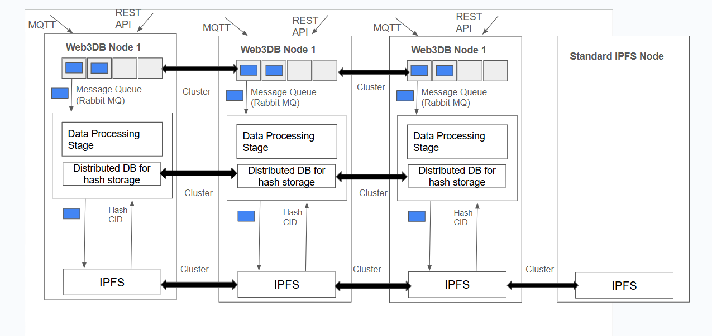

# Test Scripts for Web3db

This repo has test scripts to test the Web3db. To know more about Web3db, please visit: https://www.web3db.org/

The architecture of Web3db is shown below:





Web3db source code: https://github.com/Chandan-M-N/web3db_reloaded


Install the requirements.

```sh
pip install -r requirements.txt
```

Please refer combinations to test for running the scripts. 

# HTTP Publisher

`http_publisher.py` This script publishes sensor data via HTTP to a specified host and visualizes it in real time. The data published is stored in Web3db

## Arguments
- `--host` (`-h`): API host (default: `75.131.29.55`). Host to which data is published.
- `--topic` (`-t`): Data topic (default: `heart_rate`)
- `--vitals` (`-v`): Comma-separated value names (default: `value`). 
- `--range` (`-r`): Comma-separated min-max range for each vital (default: `70,80`). The values between these range are published to host. Number of min, max range values should match the number of vitals.

### Example
```sh
python3 http_publisher.py --host 75.131.29.55 --topic temperature --vitals temp,humidity --range 20,30,40,60
```

## How It Works
- Generates random sensor data within the given range.
- Sends data to `http://host:5100/add-medical`.
- Plots the published data in real time.

## Stopping the Script
Press `Ctrl+C` to exit.


# HTTP Querier

`http_querier.py` is a Python script that queries data from Web3db, processes the data, and plots it in real-time using Matplotlib. The script plots data points from the time when it is started.

## Usage
Run the script with optional arguments:

```sh
python3 http_querier.py --h <host> --t <topic>
```

### Arguments:
- `--h, --host`: API host (default: `75.131.29.55`)
- `--t, --topic`: Data topic to query (default: `heart_rate`)

### Example:
```sh
python http_querier.py --h 75.131.29.55 --t temperature
```

## How It Works
1. Sends a POST request to `http://<host>:5100/fetch-medical` with the specified topic.
2. Processes and normalizes timestamps.
3. Plots the retrieved data in real-time.
4. Updates the graph every 2 seconds.


# MQTT Publisher

This Python script (`mqtt_publisher.py`) publishes simulated sensor data to an MQTT broker and visualizes the data in real-time using Matplotlib. The data published is stored in Web3Db

The usage and arguments

## Usage
Run the script with optional arguments:
```sh
python3 mqtt_publisher.py [--h HOST] [--t TOPIC] [--v VITALS] [--r RANGE]
```

### Arguments:
- `--h` (`--host`): MQTT broker host (default: `75.131.29.55`)
- `--t` (`--topic`): MQTT topic (default: `heart_rate`)
- `--v` (`--vitals`): Comma-separated names of vitals (default: `value`)
- `--r` (`--range`): Comma-separated min/max values per vital (default: `70,80`)

### Example:
```sh
python mqtt_publisher.py --h 75.131.29.55 --t temperature --v temp,humidity --r 20,30,50,60
```
This will:
- Connect to `192.168.1.1`
- Publish to the topic `sensor/temperature`
- Generate data for `temp` (20-30) and `humidity` (50-60)

## How It Works
1. Parses command-line arguments for broker settings.
2. Generates random sensor data within specified ranges.
3. Publishes data in JSON format to the MQTT broker.
4. Updates a real-time Matplotlib plot.


# MQTT Subscriber

`mqtt_subscriber.py` is a Python script that subscribes to an MQTT broker, receives data from a specified topic, and plots it in real-time using Matplotlib. It is designed to visualize data streams from a selected topic, like sensor readings, with a real-time graph.

## Usage
Run the script with optional arguments:

```sh
python3 mqtt_subscriber.py --h <host> --t <topic>
```

### Arguments:
- `--h, --host`: API host (default: `75.131.29.55`)
- `--t, --topic`: Data topic to query (default: `heart_rate`)

### Example:
```sh
python3 mqtt_subscriber.py --h 75.131.29.55 --t temperature
```

## How It Works
1. Connects to the specified MQTT broker.
2. Subscribes to the given topic.
3. Processes and decodes the incoming data, which can be in JSON or key-value format.
4. Extracts the timestamp and data values from the payload.
5. Plots the data values in real-time, with the X-axis showing the timestamp and the Y-axis showing the data values.
6. Updates the graph every 0.5 seconds.
7. If multiple data values are present, it plots each value on a separate line.


# Combinations to test.

1. Run http_querier.py with a required host and topic. Parallely in a different terminal run the http_publisher.py by specifying the args.
2. Run http_querier.py with a required host and topic. Parallely in a different terminal run the mqtt_publisher.py by specifying the args.
3. Run mqtt_subscriber.py with a required host and topic. Parallely in a different terminal run the mqtt_publisher.py by specifying the args.


# IOT device Bed dot test.


`bed_dot.py` This Python script subscribes to sensorweb.us where the Bed dot IOT device is hosted. It receives real-time data from a specified topic, and plots it using Matplotlib. It allows visualization of sensor data or any real-time data stream in a time-series plot.
The data received from IOT device is pipelined to Web3db

## Usage
Run the script with optional arguments:

```sh
python3 bed_dot.py --h <host> --t <topic>
```

### Arguments:
- `--h, --host`: API host (default: `75.131.29.55`)
- `--t, --topic`: The MQTT topic of bed_dot to subscribe to (default: /unknown_org/74:4d:bd:89:2d:f4/vital).

### Example:
```sh
python3 bed_dot.py --h 75.131.29.55 --t /unknown_org/74:4d:bd:89:2d:f4/vital
```

## How It Works
1. Connects to the source MQTT broker (sensorweb.us by default).
2. Subscribes to the specified topic on the source broker.
3. Receives the payload and parses the data:
4. The data is expected to be semicolon-separated key-value pairs.
5. The timestamp is recorded and the rest of the data is treated as sensor readings.
6. Real-time updates to a plot are generated, showing timestamped data values.
7. The plot updates every 0.5 seconds.

# Sample combination test for Bed dot and Web3db

1. Run the http_querier.py with topic as an argument where the data is sent from Bed dot. Run the bed_dot.py along with topic of bed dot to subscribe.

```sh
python3 http_querier.py --h 75.131.29.55 --t /unknown_org/74:4d:bd:89:2d:f4/vital

python3 bed_dot.py --h 75.131.29.55 --t /unknown_org/74:4d:bd:89:2d:f4/vital
```
